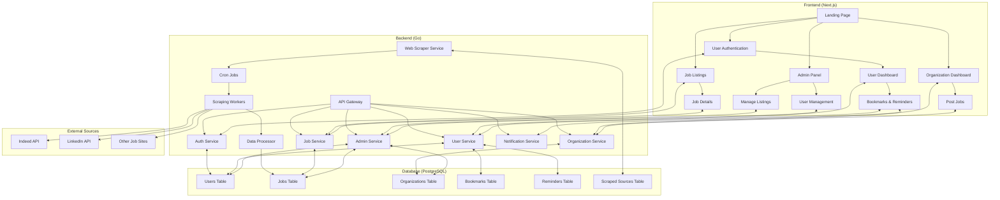

```mermaid
graph TD
    subgraph "Frontend (Next.js)"
        A[Landing Page] --> B[Job Listings]
        B --> C[Job Details]
        A --> D[User Authentication]
        D --> E[User Dashboard]
        E --> F[Bookmarks & Reminders]
        A --> G[Organization Dashboard]
        G --> H[Post Jobs]
        A --> I[Admin Panel]
        I --> J[Manage Listings]
        I --> K[User Management]
    end

    subgraph "Backend (Go)"
        L[API Gateway] --> M[Auth Service]
        L --> N[Job Service]
        L --> O[User Service]
        L --> P[Organization Service]
        L --> Q[Admin Service]
        L --> R[Notification Service]
        S[Web Scraper Service] --> T[Cron Jobs]
        T --> U[Scraping Workers]
        U --> V[Data Processor]
    end

    subgraph "Database (PostgreSQL)"
        W[Users Table]
        X[Jobs Table]
        Y[Organizations Table]
        Z[Bookmarks Table]
        AA[Reminders Table]
        AB[Scraped Sources Table]
    end

    B <--> N
    C <--> N
    D <--> M
    E <--> O
    F <--> O
    G <--> P
    H <--> P
    J <--> Q
    K <--> Q
    F <--> R
    V --> X
    M <--> W
    N <--> X
    O <--> W
    O <--> Z
    O <--> AA
    P <--> Y
    Q <--> W
    Q <--> X
    Q <--> Y
    S <--> AB
    
    subgraph "External Sources"
        AC[Indeed API]
        AD[LinkedIn API]
        AE[Other Job Sites]
    end
    
    U --> AC
    U --> AD
    U --> AE
```
